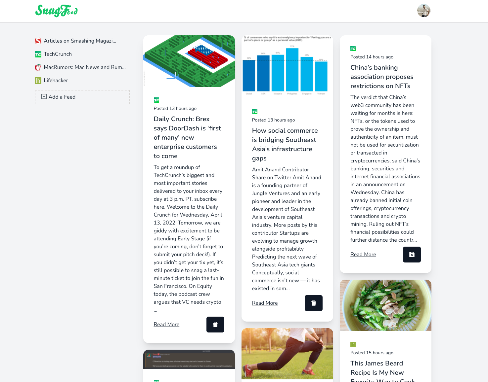

<p align="center">
  <a href="https://github.com/jadenlemmon/snugfeed"></a>
</p>

<p align="center">
   Keep track of all your favorite articles and news sources in one place!
</p>

<p align="center">
  <a href="#badge"></a>
  <a href="#badge"></a>
</p>

<div align="center">
  
</div>

## Setup

First create a `.env.docker` file.

```bash
npm i
docker-compose up
```
